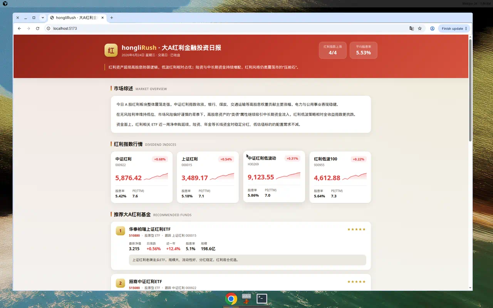
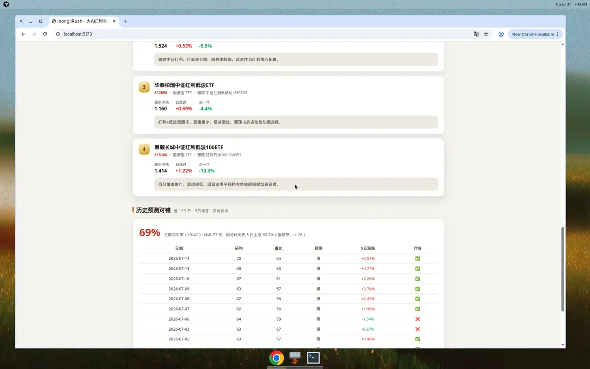

# hongliRush · 大A红利金融投资日报

> 面向 A 股「红利 / 高股息」主题的**量化研判日报引擎**：采集真实行情 → 本地量化打分 → 双打分对照 + 强制反驳 + 三情景 → 数据质量门禁 + 可信度一览 + 回测校准/预测命中 → 生成可读日报（Web + Markdown），并附精选大A红利基金推荐。

> 参考同系列 [goldRush（黄金投资研究 Agent）](https://github.com/371684029/apple-gold-rush) / [snpNasdaqRush](https://github.com/371684029/snpNasdaqRush) 的方法论，一比一迁移至「大A红利」资产，重点强化 **数据可靠性、预测准确性、日报可读性**。

<p align="center">
  
</p>

---

## 目录

- [项目简介](#项目简介)
- [三大目标怎么落地](#三大目标怎么落地)
- [功能特性](#功能特性)
- [界面预览](#界面预览)
- [技术栈](#技术栈)
- [环境要求](#环境要求)
- [快速开始](#快速开始)
- [命令一览](#命令一览)
- [数据流与架构](#数据流与架构)
- [项目结构](#项目结构)
- [数据来源与字段](#数据来源与字段)
- [设计规范](#设计规范)
- [免责声明](#免责声明)

## 项目简介

`hongliRush`（"红利 Rush"）由两部分组成：

1. **量化研判引擎（`src/engine/`，Node + TypeScript）**：一条命令即可采集大A红利指数/ETF 的**真实行情**，本地计算技术+估值+波动因子，产出「研判分 × 量化分」双打分、强制反驳、三情景、尾部风险、数据质量门禁与可信度一览，并落地 SQLite 做**回测校准与预测命中追踪**。输出为 Markdown 日报 + JSON。
2. **Web 仪表盘（`src/`，React + Vite）**：消费引擎生成的 `public/hongli-latest.json`，把上述结论渲染成一页可读的红利日报。

> 数据经 **Yahoo Finance** 实时采集，零 API Key、零 LLM 依赖，**可复现、可审计**。页面内容仅供投资研究参考，**不构成任何投资建议**。

## 三大目标怎么落地

| 目标 | 落地机制 |
| --- | --- |
| **数据可靠性** | Yahoo 真实行情（指数实时点位 + 跟踪 ETF 日线历史）；**数据质量门禁**（green/yellow/red 分档 + 实时价对最近收盘的锚定一致性校核 + 缺失字段标注），红档直接关闭操作结论 |
| **预测准确性** | 纯本地**量化因子**（MA/RSI/MACD/布林/估值百分位/波动率/相对强弱）→ **双打分**（研判×量化，冲突则弃权）→ **强制反驳**下修 → SQLite 存档 + **回测校准**（评分区间 vs 实际 5 日涨跌）+ **预测命中追踪**（无前视偏差回填） |
| **日报可读性** | **可信度一览**（三行看懂 + 评分展示区间）、评分条/因子条、三情景概率、仓位建议、命中率与校准上下文；Markdown 与 Web 双呈现 |

## 功能特性

- 📈 **真实红利指数行情**：中证红利(000922)、上证红利(000015)、沪深300红利(000821) 实时点位。
- 🔢 **量化研判**：研判分/量化分双体系 + 量化因子构成（可复现）。
- 🛡️ **可信度一览 + 数据质量门禁**：一眼判断「今日结论能不能作为操作依据」。
- 🧨 **强制反驳**：独立找看空论据（超买/高估值/乖离/死叉/波动放大…）并对评分下修。
- 🔮 **三情景 + 尾部风险 + 仓位建议**。
- 💰 **推荐红利基金**：510880 / 515080 / 512890 / 515100 实时净值、日涨跌、近一年收益。
- 📊 **回测校准 + 预测命中**：历史研判 vs 实际走势，量化「准确率不吹嘘」。
- ⚡ **零 API Key、零 LLM**：一条命令跑通，纯本地可复现。

## 界面预览

| 首页（可信度一览 / 双打分） | 历史预测对错（命中率 + 明细） |
| :---: | :---: |
|  |  |

## 技术栈

| 分层 | 选型 |
| --- | --- |
| 引擎语言 | Node.js + [TypeScript](https://www.typescriptlang.org/)（`tsx` 直接运行） |
| CLI | [commander](https://github.com/tj/commander.js) + [chalk](https://github.com/chalk/chalk) + [cli-table3](https://github.com/cli-table/cli-table3) |
| 数据 | [Yahoo Finance](https://finance.yahoo.com/) chart API（真实行情，无需 Key） |
| 存储 | [better-sqlite3](https://github.com/WiseLibs/better-sqlite3)（本地 SQLite，回测校准） |
| 前端 | [React](https://react.dev/) 18 + [Vite](https://vite.dev/) 5 |
| 规范 | ESLint 9（Flat Config）+ `typescript-eslint` |

## 环境要求

- **Node.js ≥ 20**（推荐 20 / 22 LTS）· **npm ≥ 9**
- 可访问 `query1/query2.finance.yahoo.com`（拉取真实行情）

## 快速开始

```bash
git clone https://github.com/371684029/hongliRush.git
cd hongliRush
npm install                 # 安装依赖（含 better-sqlite3 原生模块）

# 1) 生成当日红利日报数据（真实行情 → Markdown + public/hongli-latest.json）
npm run analysis

# 2) 启动 Web 仪表盘查看日报
npm run dev                 # 打开终端输出的本地地址（默认 http://localhost:5173/）
```

> 首次想让「回测校准 / 预测命中率」立刻有样本，可先运行 `npm run engine backfill`（用真实 ETF 历史逐日重算，无前视偏差），再 `npm run analysis`。

## 命令一览

| 命令 | 说明 |
| --- | --- |
| `npm run analysis` | 综合分析日报（量化+双打分+反驳+情景+可信度），写 `docs/*.md` 与 `public/hongli-latest.json` |
| `npm run price` | 实时红利指数/基金行情速查 |
| `npm run calibrate` | 回测校准：历史研判 vs 实际 5 日走势 |
| `npm run engine backfill` | 用真实 ETF 历史逐日回填研判样本（供校准/命中率） |
| `npm run engine history` | 查看历史分析报告 |
| `npm run engine snapshot` | 保存当日数据快照 |
| `npm run dev` / `npm run build` | Web 仪表盘 开发 / 构建 |
| `npm run lint` / `npm run typecheck:engine` | 前端 lint / 引擎类型检查 |

## 数据流与架构

```
Yahoo Finance（真实行情）
        │  指数实时点位 + 跟踪ETF日线历史
        ▼
数据采集 (src/engine/yahoo.ts)
        ▼
数据质量门禁 (data-quality.ts) ── green/yellow/red，红档关闭操作结论
        ▼
量化引擎 (indicators.ts + quant-score.ts) ── 纯本地因子 → 量化分
        ▼
研判合成 (verdict.ts) ── 研判分 = 量化 + 估值倾斜 − 强制反驳(rebuttal.ts)
        │                 + 三情景概率 + 尾部风险
        ▼
可信度一览 (reliability.ts) ── 门禁/双分/反驳/校准 → 一页可信度
        ▼
SQLite (db.ts) ── 存档 + 回测校准 + 预测命中追踪（无前视偏差）
        ▼
报告 (report.ts) ── Markdown(docs/) + JSON(public/hongli-latest.json)
        ▼
Web 仪表盘 (src/App.tsx) ── 渲染真实数据
```

> **为什么历史用 ETF？** Yahoo 对红利指数（如 `000922.SS`）只提供 1d/5d 行情，无长历史；其**跟踪 ETF**（如中证红利→`515080.SS`）有完整日线。故实时点位取指数、技术指标与回测取其跟踪 ETF，单位一致、可锚定、可回测。

## 项目结构

```
hongliRush/
├─ src/
│  ├─ engine/                 # 量化研判引擎（Node + TS）
│  │  ├─ yahoo.ts             # Yahoo 真实行情（实时 + 日线历史）
│  │  ├─ symbols.ts           # 红利指数/ETF 定义（含 historyYahoo 代理）
│  │  ├─ indicators.ts        # MA/RSI/MACD/布林/百分位/ATR
│  │  ├─ quant-score.ts       # 纯量化评分引擎
│  │  ├─ rebuttal.ts          # 强制反驳（找看空论据）
│  │  ├─ verdict.ts           # 双打分 + 情景 + 尾部风险
│  │  ├─ data-quality.ts      # 数据质量门禁（green/yellow/red）
│  │  ├─ reliability.ts       # 可信度一览卡
│  │  ├─ db.ts                # SQLite + 回测校准 + 预测追踪
│  │  ├─ report.ts            # Markdown / JSON / 控制台渲染
│  │  ├─ analysis.ts          # 编排 + 历史回填
│  │  └─ cli.ts               # CLI 入口（commander）
│  ├─ data/analysis.ts        # Web 端数据类型 + JSON 加载
│  ├─ App.tsx                 # React 仪表盘
│  └─ index.css               # 全局样式与主题
├─ public/hongli-latest.json  # 引擎生成的最新数据（Web 消费）
├─ docs/                      # Markdown 日报 + 截图
├─ data/                      # SQLite（自动生成，已 gitignore）
├─ tsconfig.engine.json       # 引擎 TS 配置
└─ package.json
```

## 数据来源与字段

- **实时行情/历史**：Yahoo Finance chart API（`query1/query2.finance.yahoo.com`），无需 API Key。
- **红利指数**：中证红利 `000922.SS`、上证红利 `000015.SS`、沪深300红利 `000821.SS`（实时点位）。
- **跟踪 ETF（历史/量化/回测源）**：中证红利→`515080.SS`、上证红利→`510880.SS`、低波代理→`512890.SS`。
- **推荐基金实时净值**：`510880 / 515080 / 512890 / 515100`。
- **参考股息率**：静态基准（`src/engine/symbols.ts` 的 `refYield`），仅供量级参考，实际以基金/指数公司披露为准。
- Web 消费的 JSON 结构见 `src/data/analysis.ts` 的 `AnalysisData`。

## 设计规范

- **涨跌配色**：遵循 A 股「红涨绿跌」——`--up` 红、`--down` 绿（见 `src/index.css`），勿按欧美习惯反置。
- **可复现优先**：所有量化因子仅来自真实价格历史，不掺入不可核验的主观数据；缺数据宁可标 N/A 也不臆造。
- **可信度 ≠ 准确率承诺**：可信度衡量「今日结论是否适合做纪律操作」，非涨跌命中保证。

## 免责声明

本项目（含页面所有文字、行情、评分、基金信息）**仅用于技术演示与投资研究参考，不构成任何投资建议或要约**。量化模型存在固有局限，历史业绩不代表未来表现，**市场有风险，投资需谨慎**，据此操作风险自担。
